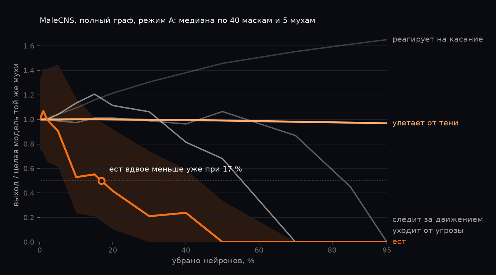

# Сколько мозга нужно мухе

Модель мозга дрозофилы по карте проводки **MaleCNS v1.0** (самец, мозг вместе со зрительными долями и нервным узлом в груди, 165 122 нейрона).
Из модели убираем случайную долю нейронов, от 0 до 95 %, и смотрим, какие умения исчезают первыми:
ест ли муха сахар, улетает ли от тени, уходит ли от угрозы, следит ли за движением,
реагирует ли на касание головы.

Это модель, живую муху никто не трогал. Модель упрощённая: в ней нет химии мозга, обучения и компенсации после потери нейронов.

## Результаты



Доля удалённых клеток, при которой умение слабеет вдвое (p50). В скобках 95 % интервал оценки: бутстреп по наборам удалённых клеток. MaleCNS: w = 0,152 мВ, сахар 80 Гц, 5 «мух». FlyWire: граф ≥5 синапсов, w = 0,275 мВ, сахар 40 Гц, одна «муха» без разброса порога, 40 масок, без интервала.

| Умение | Режим A, полный граф | Режим A, ≥5 синапсов | Режим B, полный граф | FlyWire 783, режим A |
|---|---|---|---|---|
| ест | **17 %** (9–27) | 17,5 % (9–25) | 9 % (3–20) | 19 % |
| уходит от угрозы (поворот от тени сбоку) | 55 % (39–75) | 52 % (38–75) | 36 % (20–46) | 53 % |
| следит за движением (поворот к движущейся точке) | 83 % (81–87) | 83 % (81–87) | 68 % (45–73) | 79,5 % |
| улетает от тени | не падает (0,97 на 95 %) | не падает (0,96) | 86 % (83–87) | не падает (0,99) |
| реагирует на касание головы | не падает, растёт до 1,65 | растёт до 1,57 | 88 % (86–90) | растёт |

- **Порядок одинаковый** на обоих графах, в обоих режимах и на мозге самки (FlyWire): сначала пропадает еда, последними взлёт от тени и ответ на касание.
- **Возможное объяснение (мы его не проверяли).** У гигантского волокна (DNp01) 47–48 % возбуждающего входа идёт прямо от LC4/LPLC2, у нейронов DNg головы 19–69 % прямо от щетинок. От вкусовых нейронов к MN9 и от зрительных к DNa прямой связи нет, минимум два звена (`results/malecns/direct_inputs_malecns_all.json`). Повороты при этом держатся намного дольше еды, хотя прямой связи у них тоже нет, так что одной длиной пути порядок не объясняется.
- **Разброс большой.** p50 еды по отдельным наборам удалённых клеток (медиана по 5 мухам) идёт от 1 до 68 %: у половины наборов еда слабеет вдвое уже к 10 %, у 7 наборов из 40 только после 30 %. Поэтому числа даны с интервалами, а для главного режима взято 40 наборов на долю.
- **«Два нейрона» не подтвердились на MaleCNS.** На FlyWire удаление одного-двух нейронов PVLP069 снимает подавление еды тенью, в том числе в постановке Chen & Xi (MN9 2,3 → 85 Гц). На MaleCNS ни PVLP069, ни один из 208 нейронов, проверенных поодиночке (624 прогона, `results/malecns/bottleneck_singles_malecns_all.csv`), этого не делает. Полностью еду под тенью возвращает удаление 35 главных получателей сигнала от LC4/LPLC2, половины этой группы по 17–18 нейронов возвращают её примерно наполовину, четверти по 8–9 нейронов почти не возвращают (`bottleneck_chunks_malecns_all.csv`, шаги в `minimal_set_malecns_all.json`). Подавление еды при угрозе там распределённое, как пишут Chen & Xi.
- **Контроли.**
  - Та же доля синапсов, удалённых россыпью, бьёт по еде ещё сильнее (p50 около 5–6 % синапсов).
  - На проводке, перемешанной с сохранением степеней, при w = 0,152 мВ умений нет с самого начала.
  - При w = 0,275 мВ мозг MaleCNS уходит в разгон от любого входа. Умения там держатся дольше за счёт общего разгона, поэтому эти прогоны идут только как проверка.

Все таблицы в `results/`, графики и методика в `methods/`.

## Модель

- **Нейрон:** leaky integrate-and-fire с параметрами Shiu et al. 2024 (Nature 634, 210–219). Это v_rest = v_reset = −52 мВ, v_th = −45 мВ, τ_m = 20 мс, τ_syn = 5 мс, рефрактерность 2,2 мс, задержка 1,8 мс.
- **Синапс:** вес = w × число синапсов × знак. Для MaleCNS w = 0,275 / 1,81 = 0,152 мВ, потому что у самца медианно в 1,81 раза больше синапсов на нейрон, чем во FlyWire (по 7 327 сопоставленным типам, оценка flymsg). При w = 0,275 мВ (значение для FlyWire) мозг MaleCNS от любого входа уходит в самоподдерживающийся разгон: 13–22 тыс. активных нейронов (см. `results/malecns/calibration.csv`).
- **Знак:** по `consensus_nt` MaleCNS. ГАМК, глутамат и гистамин дают −1, ацетилхолин, дофамин, серотонин и октопамин дают +1. Если медиатор не определён, берётся `celltype_predicted_nt`, иначе +1.
- **Графы:**
  - полный, все связи между нейронами со статусом Traced (25,6 млн рёбер);
  - «≥5 синапсов» (6,2 млн рёбер).
- **Вход:** пуассоновские спайки на сенсорных нейронах.
- **Движок:** `engine/evlif.c`, событийный: считаются только «проснувшиеся» нейроны. Удалённый нейрон не обновляется, не спайкует и ничего не получает.

Проверка движка на FlyWire 783. Сахар 150 Гц на 129 нейронах sugar/water даёт на MN9 150 Гц справа и 111 Гц слева, это опубликованный ориентир модели (`tests/test_engine.py`).

## Умения

| Умение | Вход (MaleCNS `type`) | Считывание |
|---|---|---|
| ест | сахар: LB3, LB3a–d, LB2d (83 нейрона), 80 Гц | MN9 (мотонейрон хоботка), левый и правый |
| бросает горькое | сахар 80 Гц + горькое LB1a–d (38), 150 Гц | доля, на которую горькое гасит MN9 |
| улетает от тени | LC4 + LPLC2 обеих сторон (311), 150 Гц | DNp01 (гигантское волокно) |
| уходит от угрозы | LC4 + LPLC2 левой стороны (165), 150 Гц | DNa01 + DNa02 правой стороны |
| следит за движением | LC10a левой стороны (135), 150 Гц | DNa02 левой стороны |
| реагирует на касание головы | механорецепторы щетинок головы без глазных (212), 150 Гц | DNg15, DNg35, DNg84, DNg85, DNg48 |

Сахар в MaleCNS даёт MN9 только от ~80 Гц. При 40 Гц (частота из работ на FlyWire) ответа почти нет (~1 Гц). На полном графе от 100 Гц, на графе ≥5 при 150 Гц загорается обонятельный «пожар»; случайные сенсорные наборы с «пожаром» сами гонят MN9 до 18–46 Гц (см. калибровку).

## Протокол

- **Режим A «мозг»:** стимулируемые входы и считывающие нейроны защищены, удаляются все остальные.
- **Режим B «мозг и органы чувств»:** защищены только считывающие нейроны.
- **Доли:** 0, 1, 2, 5, 10, 15, 20, 30, 40, 50, 70, 85, 95 %. Доля считается от всех нейронов модели (мозг, зрительные доли и нервный узел в груди), кроме защищённых. Удаление случайное, поэтому из самого мозга уходит та же доля.
- **Маски вложенные:** сид маски задаёт случайный порядок нейронов, и доля p убирает первые p·n из них.
- **«Мухи»:** 5 штук, у каждой свой разброс порога v_th (sd 0,5 мВ).
- **Прогоны:** 3 пуассоновских трайла по 0,3 с, dt 0,2 мс.
- **Метрика:** выход умения / медиана выхода той же мухи с целым мозгом. На каждой доле берём медиану и межквартильный размах по маскам и мухам.
- **p50:** доля, при которой медиана падает ниже 0,5. 95 % интервал считается бутстрепом по маскам: маска берётся целиком со всеми мухами.
- **Контроли:**
  - та же доля синапсов, удалённая россыпью по всему графу;
  - проводка, перемешанная с сохранением степеней (цели синапсов переставлены отдельно внутри возбуждающих и внутри тормозных). На ней умений нет с самого начала.

## Как повторить

Нужны Python 3.12 и около 10 ГБ диска. Хватит CPU, GPU не нужен.

```bash
python -m venv .venv                     # или: uv venv .venv --python 3.12
.venv/bin/pip install -r requirements.txt   # Windows: .venv\Scripts\pip
python engine/build.py                   # собирает движок (cc/clang, иначе zig из pip)
python scripts/prepare.py --flywire      # скачивает MaleCNS (0,57 ГБ) и FlyWire (0,88 ГБ), строит графы
python -m pytest tests -q
python scripts/validate_flywire.py       # проверка движка на FlyWire
python scripts/calibrate_malecns.py      # какие умения есть в целом мозге MaleCNS и при каких частотах
python scripts/curves.py --graph malecns_all --w 0.152 --sugar 80 --modes A --masks 40
python scripts/curves.py --graph malecns_all --w 0.152 --sugar 80 --modes B syn
python scripts/pvlp069.py                # проверка «двух нейронов»
python scripts/paths.py                  # пути от тени к мотонейрону хоботка
python scripts/direct_inputs.py          # доля прямого входа от стимулируемых клеток на каждый выход
```

Прогоны идут параллельно по ядрам, результаты пишутся построчно, и прерванный скрипт продолжает с места остановки.

На Ryzen 7 7800X3D (14 процессов) весь `scripts/run_pipeline.py` занимает около 3 часов. Главная кривая на полном графе (2 600 наборов «маска × муха») идёт около 35 минут, на графе ≥5 около 11 минут. Нужно около 4 ГБ свободной памяти (14 копий полного графа по ~0,2 ГБ плюс сам Python).

```bash
python scripts/run_pipeline.py            # всё по порядку, каждый шаг продолжает с места остановки
```

## Данные и ссылки

- **MaleCNS v1.0:** FlyEM Project Team (HHMI Janelia), Cambridge Connectomics Group (MRC LMB), University of Cambridge, Google Research, лицензия [CC BY 4.0](https://creativecommons.org/licenses/by/4.0/). https://male-cns.janelia.org/. Изменения: оставлены связи между нейронами со статусом Traced (и отдельно от 5 синапсов); знак взят по предсказанному медиатору; в модели удаляются нейроны. Данные в репозиторий не входят, `scripts/prepare.py` скачивает их с сайта проекта.
- **FlyWire FAFB v783**, только для проверки движка: Dorkenwald et al. 2024, Schlegel et al. 2024, связи [Zenodo 10676866](https://zenodo.org/records/10676866).
- **Модель:** Shiu P. K. et al. A Drosophila computational brain model reveals sensorimotor processing. *Nature* 634, 210–219 (2024).
- **Близкие работы:**
  - Chen W.-Q., Xi W. Whole-brain connectomics of Drosophila reveals a robust, distributed architecture for the suppression of feeding during escape. bioRxiv 10.64898/2025.12.14.694122;
  - [chris017/fly-connectome-escape-circuit](https://github.com/chris017/fly-connectome-escape-circuit).

## Лицензия

Код: MIT (`LICENSE`).
